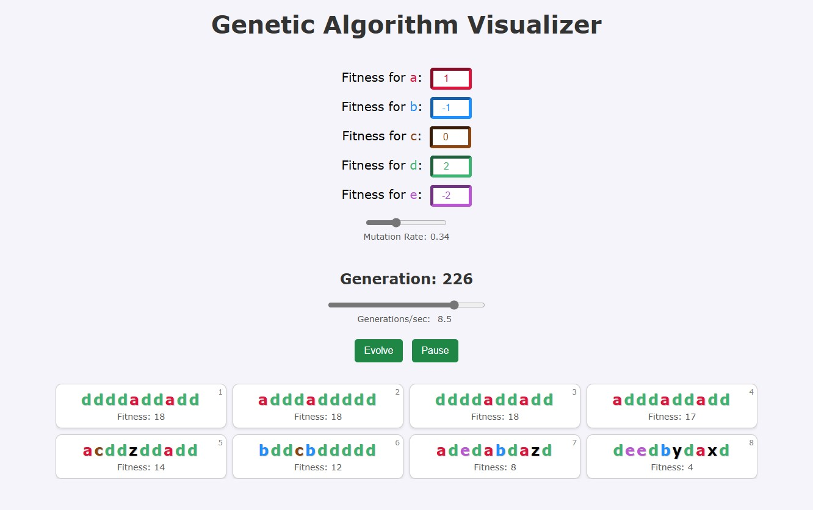

# Genetic Algorithm Visualizer

Watch a population of 8 strings evolve in real-time as you change the fitness of the gene pool.

## __Controls__

- __Set the contributing fitness value of each gene:__ `[a, b, c, d, e]`

- __Spacebar:__ Start/stop evolution

- __Slider:__ Adjust the speed of evolution 

## __Screenshot__

## __Description__

- We have a constant population of 8 strings (each represented by 10 characters)

- The fitness of a string is equal to the sum of the values of its genes
	- Genes that are not assigned a value `[w, x, y, z]` default to 0

- __Evolution Process:__
	1. The top 4 (fittest) creatures are selected as the parents.

	1. Random pairs of parents crossover to produce 1 offspring, until there are 8 new children (strings).

		Single-point crossover is used.

	1. These children undergo mutation.

		There is a $10\%$ chance for each gene to be replaced with a random other.

	1. __Replacement Strategy:__

		- We have 8 creatures in the current generation and a group of 8 children (16 creatres total)

		- The top 4 overall move on to the next generation (elitism)

		- 4 random (but not yet chosen) children will join them

## __Technical Notes__

- The __top row__ of 4 cells following a non-decreasing pattern towards optimality due to elitism. They will eventually converge to ideal genetics given the selected fitness values.

- The __bottom row__ will always be direct children of the parents (top 4 cells) from the previous generation. They will, therefore, _not_ follow a non-decreasing convergence. Mutation will impact these bottom strings every generation.

 

- This simulation runs in real-time, meaning you experiment with different fitness values and watch natural selection remove a gene from the population or increase its frequency.

- You can also set the mutation rate dynamically to observe the effects on the children.

	- If the mutation rate is _too high_, the children will be nothing like the fit parents, and convergence will slow down dramatically

	- However, if the mutation rate is _too low_, the children will not be able to improve on their parent's genes with new information, and convergence could plateau after some time
